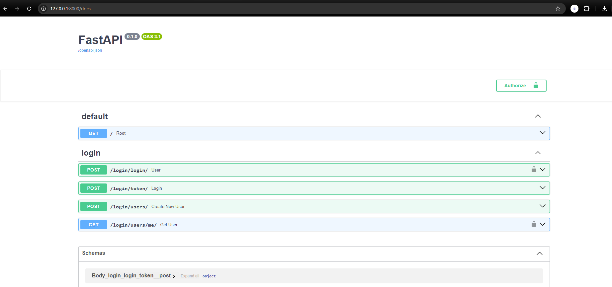

<p align="center">
  <a href="https://fastapi.tiangolo.com"></a>
</p>
<p align="center">
    <em>FastAPI framework, high performance, easy to learn, fast to code, ready for production</em>
</p>
<p align="center">
<a href="https://pypi.org/project/fastapi" target="_blank">
    
</a>
</p>

---

**Documentation**: <a href="https://fastapi.tiangolo.com" target="_blank">https://fastapi.tiangolo.com</a>

**Source Code**: <a href="https://github.com/fastapi/fastapi" target="_blank">https://github.com/fastapi/fastapi</a>

---


# Microservicio de Autenticación

Este proyecto implementa un microservicio de autenticación usando FastAPI y MySQL.

## Requisitos

- Docker
- Docker Compose (opcional, pero recomendado)
- Python 3.9+
- FastAPI
---
## Docker Network
```bash
docker network create Autenticacion_Network 
```

## Contenedor Docker BD

```bash
#Correr contenedor docker sin puertos

docker run --name AutenticacionDB --network Autenticacion_Network -p 3306:3306 -e MYSQL_ROOT_PASSWORD=12345 -d mysql

#Entrar al contenedor
docker exec -it AutenticacionDB bash
```
---

## Contenedor Docker Microservicio

```bash
#Abrir una terminal y navegar al directorio del proyecto. Ejecutar el siguiente comando para construir la imagen Docker:

docker build -t microservicioautenticacion .


#Una vez creada la imagen, corremos un contenedor

docker run -d --name MicroservicioAutenticacion --network Autenticacion_Network -p 8000:8000 microservicioautenticacion

```

---
## Correr microservicio

### Instalar dependencias

```bash
pip install -r requirements.txt
```

### Correr servidor con:

<div class="termy">

```console
$ uvicorn main:app --reload  

 ╭────────── FastAPI  ────────────────────────────────────────────────────────╮
 │                                                                            │
 │  INFO:     Uvicorn running on http://127.0.0.1:8000 (Press CTRL+C to quit) │
 │  INFO:     Started reloader process [14256] using WatchFiles               │
 │  INFO:     Started server process [1880]                                   │
 │  INFO:     Waiting for application startup.                                │
 │  INFO:     Application startup complete.                                   │
 │                                                                            │
 ╰────────────────────────────────────────────────────────────────────────────╯

```

</div>


### API docs

Ahora, ve a <a href="http://127.0.0.1:8000/docs" class="external-link" target="_blank">http://127.0.0.1:8000/docs</a>. Podrás ver la documentación automática de FastAPI.




